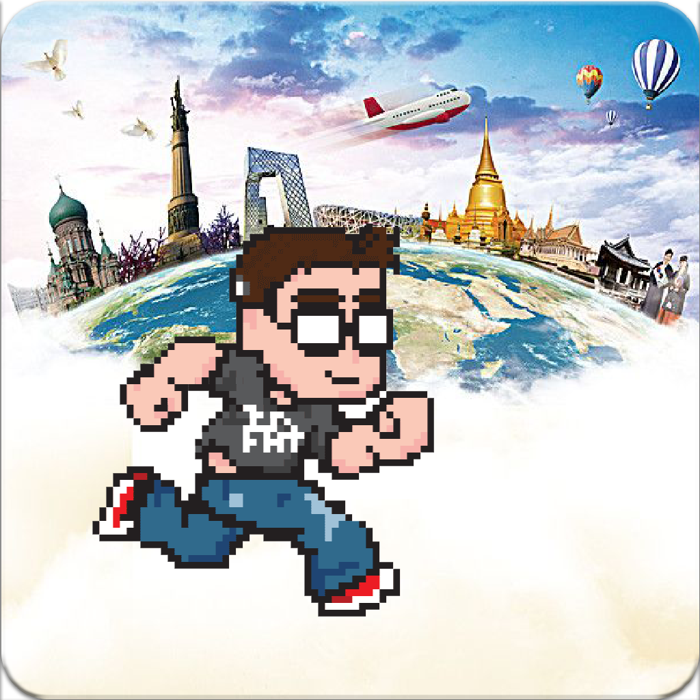
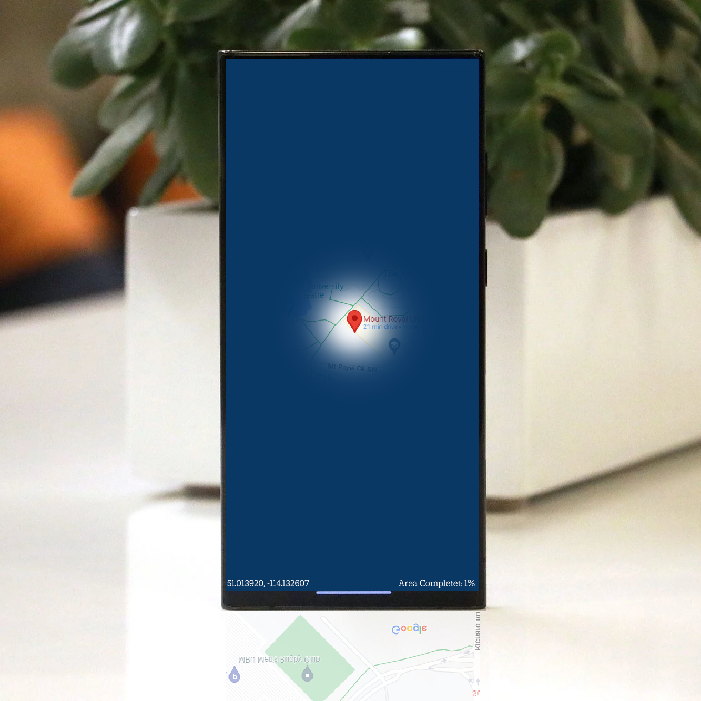

# Android App - Globe Travela

## Group Info
- Terrence Plunkett
- Lorenzo Young
- Miroslav Nikolov
- Travis Tkachyk

## Structure
### /backend
Contains a custom Python Flask API hosted on Google Cloud to save user progress.
Access Google Maps' API to display the map.

### /frontend
Contains the front-end interface of the application

## Change Procedure
The main branch is protected (no commits directly to it).
You must create a branch from main, make your changes, then pull request to merge into main.
_This prevents anyone from accidentally overwriting other's changes in main or rewriting the history. I think it's good practice._

## Testing, Building and Hosting
Automated Gitgub Actions test, Docker images for easy hosting on Google Cloud.
